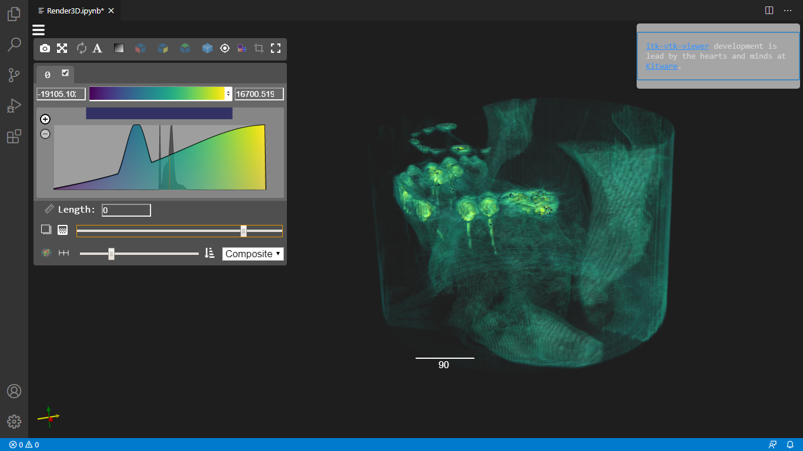
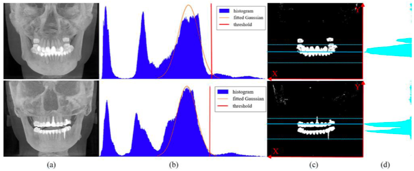
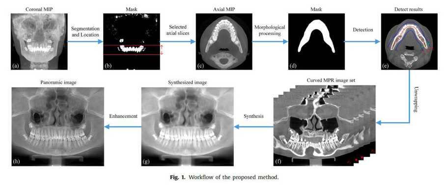
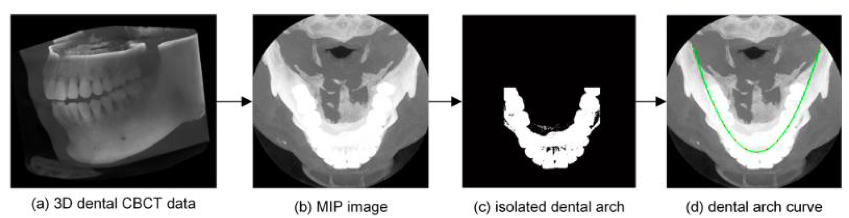
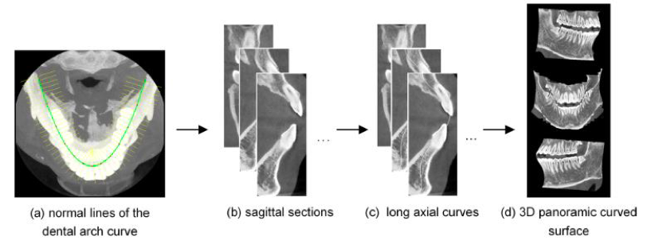

# 3D-Panoramic-Reconstruction-of-CBCT-Images
Dental Assist for early detection and diagnosis of dental caries, plaque, or periodontal infections

The first step to do this is to create a 3D panoramic reconstruction of
CBCT images.
This is done by measuring the thickness of the dental arch to eliminate the non-interesting tissues.

Maximum Intensity Projection (MIP) images are generated according to the axial slices and for each slice, 

a candidate arch is modeled as a polynomial curve and compared to the template curve derived from the training set.
The comparison is made based on Root Mean Square Error (RMSE), 
and the slice minimizing the RMSE is considered to containthe desired dental arch.

The required panoramic image is thereby generated when the intensities of the original CBCT along the appropriate arch are projected in a 2D image.

This representation will be analyzed using a CNN structure to detect the dental issues.

